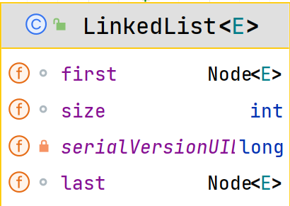

## List接口

List接口基本介绍:

List接口是Collection接口的子接口

1. List集合类中元素有序、且可重复
2. List集合中的每个元素都有其对应的顺序索引，即支持索引。
3. List容器中的元素都对应一个证书型的序号记载其在容器中的位置，可以根据序号存取容器中的元素。
4. JDK API中List接口的实现类有：

### 1. List常用方法

```java
public class ListMethod {
    public static void main(String[] args) {
        ArrayList list = new ArrayList();
        list.add("张三丰");
        list.add("贾宝玉");


//         void add(int index,Object ele): 在index位置插入ele元素
//         void add(Object ele) : 在最后插入一个对象
        // 在 index = 1 的位置插入一个对象
        list.add(1, "jim"); //如果不写,则在最后的位置
        System.out.println(list);


//        boolean addAll(int index,Collection eles): 从index位置开始将eles中的所有元素添加进来
        List list1 = new ArrayList();
        list1.add("jack");
        list1.add("tom");
        list.addAll(1, list1);   //不写index则添加在最后的位置 ;
        System.out.println(list);

//         Object get(int index): 获取指定index位置的元素
        // 跳过


//        int indexOf(Object obj): 返回obj在集合中首次出现的位置
        System.out.println(list.indexOf("tom"));//2


//        int lastIndexOf(Object obj): 返回obj在当前集合中末次出现的位置
        System.out.println(list.lastIndexOf("jim"));


//        Object remove(int index) : 移除指定index位置的元素,并返回此元素
        list.remove(0);
        System.out.println(list);


//        Object set(int index, Object ele): 设置指定index位置的元素ele,相当于替换
        list.set(1, "玛丽");          // 如果给不存在的 则抛异常
        System.out.println(list);


//        List subList（int fromIndex，int toIndex): 返回从fromIndex到toIndex位置的子集合
        // 注意返回的子集合 [0,2);
        List list2 = list.subList(0, 2);
        System.out.println(list2);

    }
}
```

### 2.List的接口的三种遍历方式

1. iterator(迭代器)
2. 增强for循环
3. 普通for

### 3.List排序

使用冒泡排序:

```java
public class ListExercise {
    public static void main(String[] args) {

        List list = new ArrayList();
        list.add(new Book("红楼梦", "曹雪芹", 100));
        list.add(new Book("西游记", "吴承恩", 10));
        list.add(new Book("水浒传", "施耐庵", 9));
        list.add(new Book("三国演义", "罗贯中", 80));

        // 对集合进行排序

        for (Object o : list) {
            System.out.println(o);
        }

        // 冒泡排序
        sort(list);

        list.forEach(a -> {
            System.out.println(a);
        });
    }

    public static void sort(List list) {
        for (int i = 0; i < list.size() - 1; i++) {
            for (int j = 0; j < list.size() - 1 - i; j++) {
                Book o1 = (Book) list.get(j);
                Book o2 = (Book) list.get(j + 1);
                if (o1.getPrice() > o2.getPrice()) {
                    list.set(j, o2);
                    list.set(j + 1, o1);
                }

            }
        }
    }

}
```

## ArrayList

### 1.ArrayList注意事项

* permits all elements,including null,ArrayList可以加入null,并且多个
* ArrayList 是由数组来实现数据存储的
* ArrayList 基本等同于Vector,除了ArrayList是线程不安全(执行效率高),在多线程情况下,不建议使用ArrayList

### 2.ArrayList底层结构和源码分析

1. ArrayList中维护了一个Object类型的数组elementData
2. 当创建ArrayList对象时,如果使用的是无参构造器,则初始elementData容量为0,第1次添加,则扩容elementData为10,如需要再次扩容,则扩容elementData为1.5倍
3. 如果使用的是指定大小的构造器,则初始elementData容量为指定大小,如果需要扩容,则扩容elementData为1.5倍

## Vector

### 1.Vector基本介绍

1. Vector类的定义说明

```java
public class Vector<E>
        extends AbstractList<E>
        implements List<E>, RandomAccess, Cloneable, java.io.Serializable
```

2. Vector底层也是一个对象数组,protected Object[] elementData;
3. Vector是线程同步的,即线程安全,Vector类的操作方法带有*synchronized*
4. 在开发中,需要线程同步安全时,考虑使用Vector
5. 如果是无参,默认10,满后,就按2倍扩容.如果指定大小,则每次直接按2倍扩

## LinkedList

### 1.LinkedList基础

1. LinkedList底层实现了双向链表和双端队列特点
2. 可以添加任意元素(可重复元素),包括null
3. 线程不安全,没有实现同步

### 2.LinkedList底层结构

1. LinkedList底层维护了一个双向链表
2. LinkedList中维护了两个属性first和last分别指向首节点和尾节点
3. 每个节点(Node对象),里面又维护了prev、next、item三个属性，其中通过prev指向前一个,通过next指向后一个节点.最终实现双向链表
4. 所以LinkedList的元素的添加和删除,不是通过数组完成的,相对来说效率较高
   


## ArrayList和LinkedList比较
* ArrayList和LinkedList的比较

|            | 底层结构 |   增删效率    | 改查的效率 |
|:----------:|:----:|:---------:|:-----:|
| ArrayList  | 可变数组 |  较低,数组扩容  |  较高   |
| LinkedList | 双向链表 | 较高,通过链表追加 |  较低   |

**如何选择ArrayList和LinkedList:**
1. 如果改查的操作多,选择ArrayList
2. 如果增删的操作多,选择LinkedList
3. 一般来说,在程序中,80%-90%都是查询,因此大部分情况下会选择ArrayList
4. 在一个项目中,根据业务灵活选择,也可能这样,一个模块使用的是ArrayList,另一个模块使用LinkedList