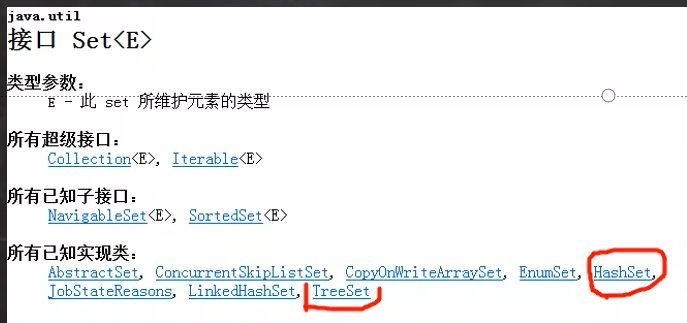
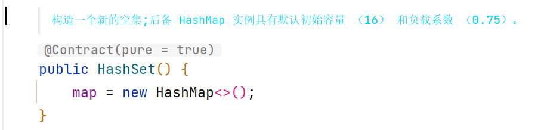
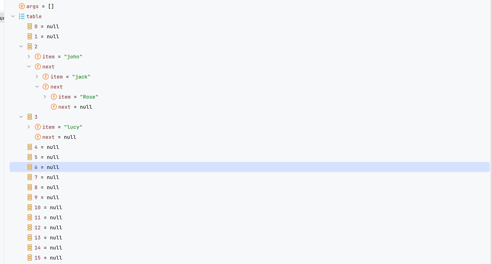

# Set接口基本介绍

1. 无序(添加和取出的顺序不一致),没有索引
2. 不允许重复元素,所以最多包含一个null
3. JDK API中Set接口的实现类有:
   

## Set接口和常用方法

* Set接口的常用方法
  和List接口一样，Set接口也是Collection的子接口，因此，常用方法和Collection接口一样
* Set接口的遍历方式

1. 迭代器
2. 增强for
3. 不能使用索引的方式来获取

## Set接口实现类-HashSet

* HashSet的全面说明

1. HashSet实现了Set接口
2. HashSet实际上是HashMap,下图
   
3. 可以存放null值,但是只能有一个null
4. HashSet不保证元素是有序的,取决于hash后,再确定索引的结果.(即,不保证存放元素的顺序和取出顺序一致)
5. 不能有重复元素/对象.

#### 1.HashSet的案例

下面这段代码在添加一个重复的元素时会返回false,

输出时是无序的;

代码:

```java
public class HashSet01 {
    public static void main(String[] args) {
        HashSet set = new HashSet();
        // 1. 在执行add'方法后,会返回一个boolean值
        // 2. 如果添加成功,返回true,否则返回false
        // 3. 可以通过remove 指定删除哪个对象
        System.out.println(set.add("john")); // T
        System.out.println(set.add("lucy")); // T
        System.out.println(set.add("john")); // F
        System.out.println(set.add("jack")); // T
        System.out.println(set.add("Rose")); // T

        boolean john = set.remove("john");

        System.out.println(set);        // [Rose, lucy, jack]

        set = new HashSet<>();
        // 4. HashSet 不能添加相同的元素
        set.add("lucy");
        set.add("lucy"); // 加入不了

        set.add(new Dog("tom")); //可以加入
        set.add(new Dog("tom")); //可以加入
        System.out.println(set);  //[Dog{name='tom'}, Dog{name='tom'}, lucy]

        // new String
        // 看源码,做分析 ;
        set.add(new String("jack")); // Ok
        set.add(new String("jack")); //加入不了
        System.out.println(set); //[Dog{name='tom'}, Dog{name='tom'}, lucy, jack]

    }
}

class Dog {
    private String name;

    public Dog(String name) {
        this.name = name;
    }

    @Override
    public String toString() {
        return "Dog{" +
                "name='" + name + '\'' +
                '}';
    }
}
```
### 2.HashSet的底层原理

* HashSet底层机制说明
  * 分析HashSet底层是HashMap,HashMap底层是(数组+链表+红黑树);

```java
/**
 * 模拟一个HashSet的底层
 */
public class HashSetStructure {
    public static void main(String[] args) {
        // HashSet的底层就是HashMap

        // 1. 创建一个数组, 数组的类型是 Node[]
        // 2. 有些人,直接把 Node[] 数组称为 表 (Table)
        Node[] table = new Node[16];
        // 3. 创建结点
        Node john = new Node("john", null);
        table[2] = john;
        Node jack = new Node("jack", null);
        john.next=jack;   // 将jack 结点挂载到john
        Node rose = new Node("Rose", null);
        jack.next = rose; // 将rose结点挂载到jack
        Node lucy = new Node("lucy", null);
        table[3] = lucy;  // 将lucy放到 table索引为3的位置;
        System.out.println("table"+table);
    }
}
class Node {  // 结点,存储数据,可以指向下一个结点,从而星城链表
    Object item; // 存放数据
    Node next; // 指向下一个结点

    public Node(Object item, Node next) {
        this.item = item;
        this.next = next;
    }
}
```
数组+链表 结构


1. HashSet底层是HashMap
2. 添加一个元素时,先得到hash值 
