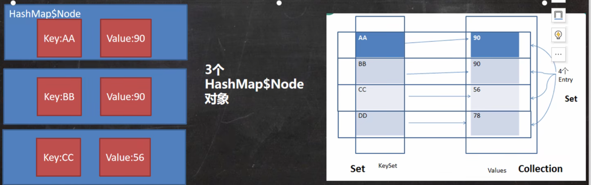

## Map接口和常用方法
* Map接口实现类的特点
**注意**: 这里说的是JDK8的Map接口特点

1. Map与Collection并列存在.用于保存具有映射关系的数据: Key-Value
2. Map中的Key和value可以是任何引用类型的数据,会封装到HashMap$Node对象中
3. Map中的key不允许重复,愿意和HashSet一样,前面分析过源码
4. Map中的value可以重复
5. Map的key可以为null,value也可以为null,注意key为null,只能有一个,value为null,可以多个
6. 常用String类型作为Map的key
7. key和value之间存在单向一对一关系,即通过指定的key总能找到对应的value
8. Map存放数据的key-value示意图,一对k-v是存放在一个Node中的,有因为Node实现了Entry接口,有些书上也说 一对k-v就是一个Entry
