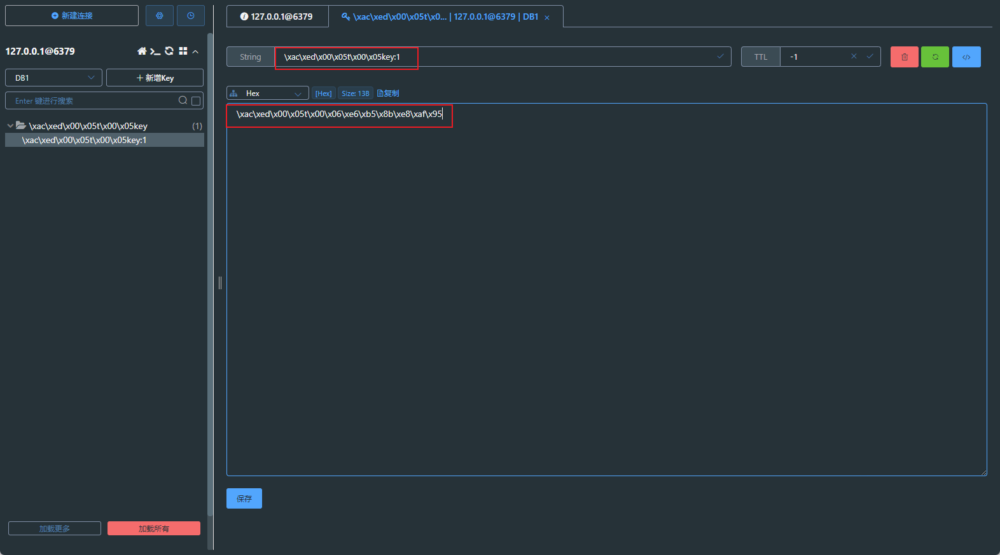
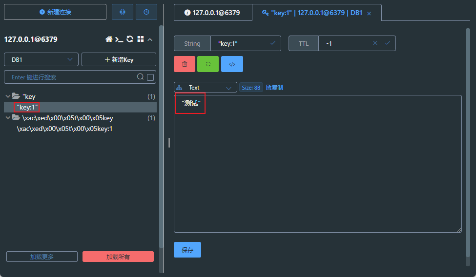

### Redis命令

##### 一、Reids连接客户端
1. Redis客户端的基本语法为：
```shell
redis-cli
```

2. 在远程服务上执行命令
```shell
redis-cli -h host -p port -a password
```

3. _补充_:

可以避免中文乱码问题
```shell
redis-cli --raw
```


##### 二、Redis键(key)
Redis 键命令用于管理redis的键


#### SpringBoot整合Redis

```xml
<!--Spring Boot 整合Redis依赖-->
<dependency>
    <groupId>org.springframework.boot</groupId>
    <artifactId>spring-boot-starter-data-redis</artifactId>
</dependency>
```
```yaml
Spring:
  data:
    redis:
      host: 127.0.0.1
      port: 6379
      username: ~
      password: ~
      # 数据库分区 
      database: 1
# Redis一共有16个分区 DB 0 -- DB 15
```

##### 测试类代码

```java
@SpringBootTest
class RedisDemoApplicationTests {

    @Autowired
    RedisTemplate redisTemplate;

    @Test
    void contextLoads() {
        ValueOperations operations = redisTemplate.opsForValue();
        operations.set("key:1","测试");
        Object o = operations.get("key:1");
        System.out.println(o);
    }
}
```

运行代码测试通过，在Redis可视化工具上看到的数据为

不方便查看，但不影响使用；

**_问题由来:_**

查看RedisTemplate源码:
在为指定序列化方法时，会使用JDK的序列化“JdkSerializationRedisSerializer”

**指定Redis序列化方式**

序列化所有数据类型

```java
@Configuration
public class RedisConfig {
    @Bean
    public RedisTemplate<String, Serializable> redisTemplate(RedisConnectionFactory factory){
        RedisTemplate<String, Serializable> redisTemplate = new RedisTemplate<>();
        redisTemplate.setConnectionFactory(factory);

        //指定 kv 的序列化方式,序列化为JSON格式;
        Jackson2JsonRedisSerializer jsonRedisSerializer = new Jackson2JsonRedisSerializer(Serializable.class);
        redisTemplate.setDefaultSerializer(jsonRedisSerializer);

        return redisTemplate;
    }
}
```
执行代码后:在工具种显示
