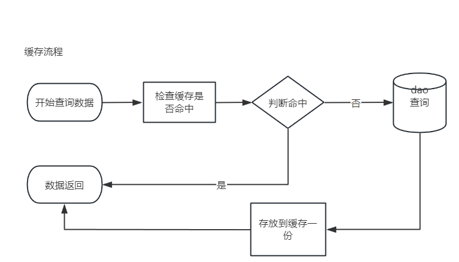
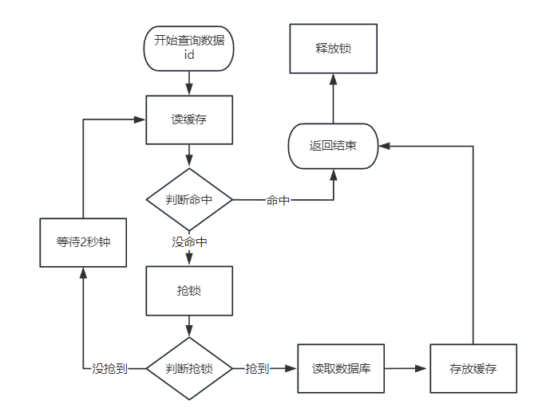
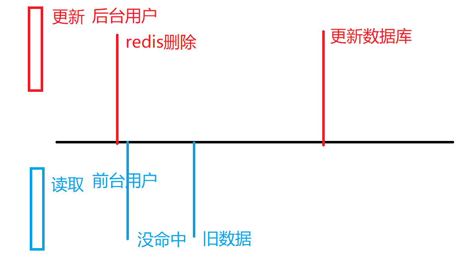
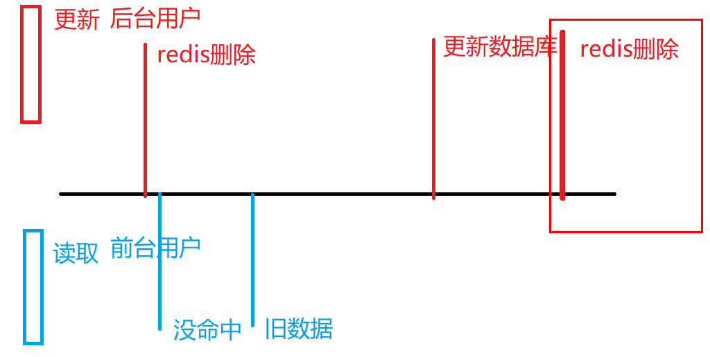

### Redis的击穿雪崩穿透
Redis主要作用是给数据库做挡箭牌，减轻数据库的压力

#### 1. 缓存击穿
高并发时，当一个key非常热点，在不停的扛着大并发，当这个key在失效的瞬间，持续的大并发就穿破缓存，直接请求数据库并设置到缓存中，导致性能下降

**解决方案:**
1. 设置永不过期   -- 部分冷们的东西可以通过算法设置永不过期
2. 加锁排队  

#### 2. 缓存雪崩
缓存集中过期，或者缓存服务器宕机，导致大量请求访问数据库，造成数据库瞬间压力过大，宕机。

**解决方案:**
1. 加锁排队
2. 随机失效时间 -- 针对缓存集过期
3. Redis高可用 -- 集群哨兵模式 

#### 3. 缓存穿透
数据库不存在缓存中也不存在,导致每次请求都会去查询数据库,这时的用户很可能是攻击者,如发起为id为"-1"的数据或id特别大(不存在的数据),导致数据库压力过大宕机

**解决方案:**
1. 数据效验
2. 缓存空对象
3. 使用布隆过滤器
   * 用户请求不存在的ID放在布隆过滤器里面. (黑名单)
   * 把有的数据放到布隆过滤器里面. (白名单)

###  缓存方案

- 缓存雪崩

   - 概念: 缓存在长期应用的系统中,存储了大量的高并发访问数据.一旦这些数据突然批量消失.访问吞吐的并发,到达数据库,导致数据库崩溃.
   - 原因:
      - 大量数据超时时间固定,相同的.
      - redis分片宕机(数据分布式).短时间造成雪崩,但是不会持续,也不会总是交给代码处理.(翻阅附录-redis分布式).因为高并发高吞吐的redis架构是cluster,保证集群高可用,数据的高可靠性.
   - 解决方案:
      - 超时时间不要固定
      - 第二种代码不提供解决方案,最多降级处理(不重要的数据降级)

- 穿透:

   - 概念: 缓存没有命中数据,同时数据库也没有命中数据,缓存穿透就出现了
   - 原因:
      - 故意造成 高并发请求,携带无效数据
      - 错误,误差
   - 解决方案:
      - 错误误差: 通过日志,监控.
      - 故意: 引入过滤器(**布隆过滤器**),拦截根本不存在的数据.或者对于数据库查询为null的(临时数据),也存储到缓存(redis可能会因为大量故意访问,出现大量null数据)

- 击穿:

   - 概念: 对于cache-aside缓存方案中,命中返回缓存,没命中查询数据库.如果没命中的数据是热点数据(并发高,访问高).可能造成大量线程在缓存都没有命中数据,都到数据库查询数据.
   - 原因: 高并发访问热点数据,缓存方案cache-aside 造成的逻辑问题.
   - 解决方案: 分布式锁.

  穿透和击穿的区别:

   1. 穿透是缓存没有,数据库也没有,击穿缓存没有,但是数据库有
   2. 都是高并发造成的影响.穿透更多的情况是大量不同数据,击穿针对少量(相同)业务数据(热点)

- 一致性

   - 批量一致性
      - 批量: 一次性处理大批数据.
      - 解决方案: 预热同步.同步刷新
   - 增量一致性
      - 增量: 一次处理1条,几条数据,相比于批量百万,千万级别数据量,非常小的数据量.

- 增量一致性场景: redis存储200万数据,有一条数据存储了一个电脑的商品信息.后台对这个电脑数据做了变更,原价在数据库200元-500元.

   - redis和mysql同步改(写,先写谁,后写谁)
      - 先写redis(200-500) 在写数据库(200-500); **问题数据库写失败.**
      - 先写数据库(200-500)在写redis(200-500); 处理事务问题.
   - redis先删,mysql写
      - 造成高并发下的数据不一致问题(因为cache-aside缓存方案).

   - 采用双删(延迟双删)

  延迟双删和双删的区别,就是第二次删除redis的时候,是否要先等待1-3秒.

