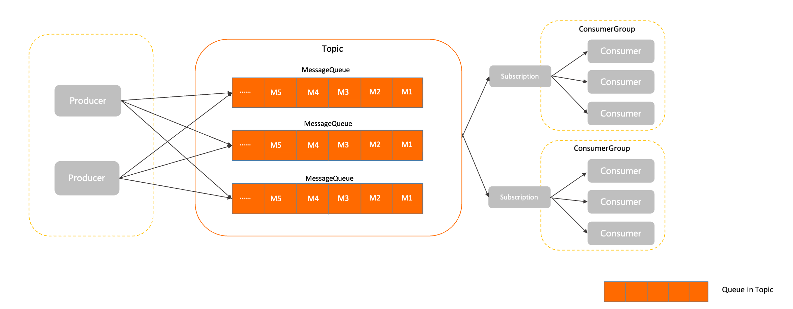
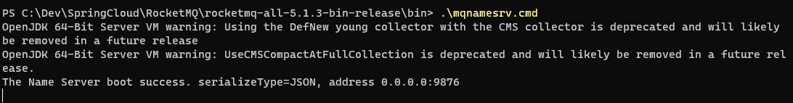
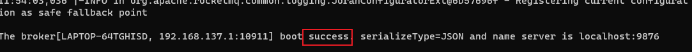

### RocketMQ

#### 1.RocketMQ介绍
RocketMQ是一款由alibaba开源的分布式消息中间件。它具有低延迟、高吞吐量、高可用性和高可靠性等特点，适用于构建具有海量消息堆积和异步解耦功能的应用系统。

##### 1.1 基本概念
* **生产者(Producer)**: 也成为消息发布者，是RocketMQ中用来构建并传输消息到服务端的运行实体。
* **主题(Topic)**: Topic是RocketMQ中消息传输和存储的顶层容器,用于标识同一类业务逻辑的消息;Topic是一个逻辑概念,并不是实际的消息容器;
* **消息队列(MessageQueue)**: 队列是RocketMQ中消息存储和传输的实际容器,也是消息的最小存储单元.
* **消费者(Consumer)**: 也称为消息订阅者,是RocketMQ中用来接收并处理消息的运行实体。
* **消费者组(ConsumerGroup)**: 消费者组是RocketMQ中承载多个消费行为一致的消费者负载均衡分组。和消费者不同,消费者组是一个逻辑概念
* **NameServer**: 可以理解成注册中心,负责更新和发现Broker服务。在NameServer的集群中,NameServer与NameServer之间没有任何通信的,它是无状态的
* **Broker**: 可以理解为消息中转角色,负责消息的存储和转发,接收生产者的消息并持久化消息;当用户发送的消息被发送到Broker时,Broker会将消息转发到与之关联的Topic中,以便让更多的接收者进行处理

##### 1.2 消息模型



##### 1.3 RocketMQ的安装与启动
[RocketMQ官网](https://rocketmq.apache.org/zh/)


在RocketMQ的bin目录下打开CMD(本地环境)

先启动mqnamesrv.cmd
```shell
.\mqnamesrv.cmd
```

再启动mqbroker.cmd
```shell
.\mqbroker.cmd -n localhost:9876
```

**启动完成后，看到success即成功**