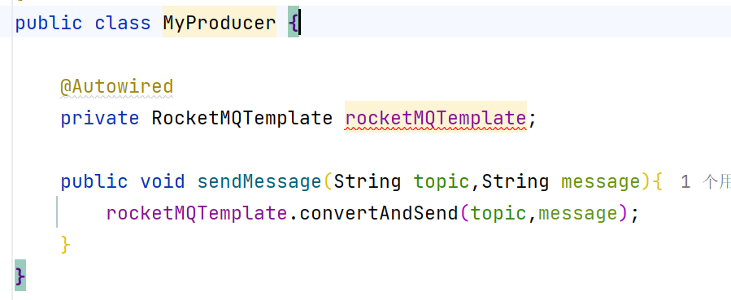

## SpringBoot 整合 RocketMQ

### 1. 准备工作

由于Spring Boot 3.x已经放弃了spring.plants自动装配.所以在注入@Autowired RocketMQTemplate 的时候会引发报错



**完成下面3部就可以解决此问题**;

#### 1.1 引入依赖

```xml

<dependency>
    <groupId>org.apache.rocketmq</groupId>
    <artifactId>rocketmq-spring-boot-starter</artifactId>
    <version>2.2.3</version>
</dependency>
```

#### 1.2 编写配置

```yaml
rocketmq:
  name-server: 127.0.0.1:9876
  producer:
    group: my-boot-producer-group
```

#### 1.3 添加装配文件

Springboot-3.0已经放弃了spring.plants自动装配，
它被/resources/META-INF/spring/org.springframework.boot.autoconfigure.AutoConfiguration.imports所取代，
添加这个文件是为了兼容。

1. 在resources下面创建META-INF/spring文件夹
2. 创建 org.springframework.boot.autoconfigure.AutoConfiguration.imports
3. 在里面加入: org.apache.rocketmq.spring.autoconfigure.RocketMQAutoConfiguration
   

### 2. 简单 Producer

完成上述步骤后,开始便携Producer

代码如下

```java

@Component
public class MyProducer {

    @Autowired
    private RocketMQTemplate rocketMQTemplate;

    public void sendMessage(String topic, String message) {
        rocketMQTemplate.convertAndSend(topic, message);
    }
}
```


