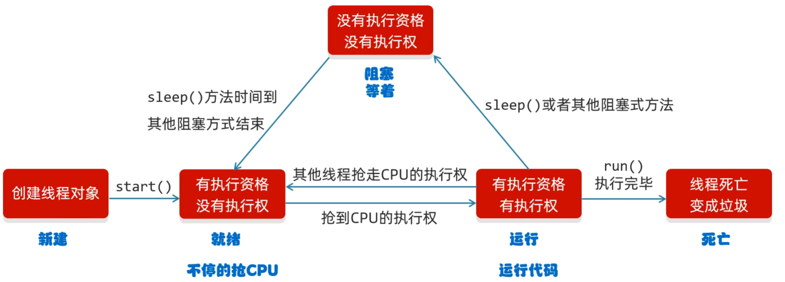

## 线程

### 一. 线程的创建方式 

线程一共有4种创建方式

1. 继承Thread 
```java
public class MyThread extends Thread{
    @Override
    public void run() {
        for (int i = 0; i < 100; i++) {
            System.out.println("Hello World"+getName());
        }
    }
}
```

2.实现Runnable
```java
public class MyRunnable implements Runnable{
    @Override
    public void run() {
        //
        for (int i = 0; i < 100; i++) {
            Thread t = Thread.currentThread();
            System.out.println("Hello World"+t.getName());

        }
    }
}
```

3. ....
4. 通过线程池

### 二. 线程的方法
1. String getName()                     返回线程的名称
2. void setName()                       设置线程的名字(构造方法也可以设置名字)
3. static void sleep(long time)         让线程休眠指定的时间,单位为毫秒
4. final void setDaemon(boolean on)     守护线程
5. public final void join()             插入线程/插队线程 
6. setPriority(int newPriority)         设置线程的优先级
7. final int getPriority()              获取线程的优先级


1,2,3
```java
public class MethodDemo {
    /*
    String getName()   返回线程的名称
    void setName()      设置线程的名字(构造方法也可以设置名字)
        细节:
            1. 如果我们没有给线程设置名字, 线程也是有默认的名字的
                        格式: Thread -X (X序号1,从0开始的)
            2. 如果我们要给线程设置名字 , 可以用set方法进行设置 , 也可以构造方法设置

    static Thread currentThread()     获取当前线程的对象
        细节:
         当JVM虚拟机启动之后, 会自动的启动多条线程
         其中有一条线程就叫做main线程

    static void sleep(long time)           让线程休眠指定的时间,单位为毫秒
     */

    public static void main(String[] args) throws InterruptedException {

        // 1.创建线程的对象
        MyThread t1 = new MyThread();
        MyThread t2 = new MyThread();

        // 2.开启线程
        t1.start();
        t2.start();

//         那条线程直行道这个方法,此时获取的就是哪条线程的对象
        Thread t = Thread.currentThread();
        String name = t.getName();
        Thread.sleep(2000);


        System.out.println(t);
    }
}
```

守护线程

```java
public class MethodDemo1 {
    public static void main(String[] args) {
        /*
        守护线程
         */
        MyThread t1 = new MyThread();
        MyThread1 t2 = new MyThread1();

        t1.setName("女神");
        t2.setName("备胎");

        t2.setDaemon(true);

        t1.start();
        t2.start();
    }
}
```

插入线程

```java
public class MethodDemo2 {
    public static void main(String[] args) throws InterruptedException {
        /*
        public final void join() 插入线程/插队线程
         */
        
        MyThread t = new MyThread();
        t.setName("土豆");
        t.start();

        //表示把t这个线程,插入到当前线程之前.

        t.join();

        for (int i = 0; i < 100; i++) {
            System.out.println("main线程" + i);
        }
    }
}
```

### 三. 线程的生命周期



**问:sleep方法会让线程睡眠,睡眠时间到了之后,立马就会执行下面的代码吗?**

答: 不会立马执行, sleep方法时间到了之后会变成就绪状态,此时会先去抢夺CPU的执行权,才会运行代码

### 四. 同步代码块


```java
public class MyThread extends Thread {

    static int ticket = 0;

    @Override
    public void run() {
        while (true) {
            synchronized (MyThread.class) {
                if (ticket < 100) {
                    try {
                        Thread.sleep(100);
                    } catch (InterruptedException e) {
                        e.printStackTrace();
                    }
                    ticket++;
                    System.out.println(getName() + "正在卖第" + ticket + "张票");
                } else {
                    break;
                }
            }
        }
    }
}
```


```java
public class ThreadDemo {
    public static void main(String[] args) {
        MyThread t1 = new MyThread();
        MyThread t2 = new MyThread();
        MyThread t3 = new MyThread();

        t1.setName("第一个");
        t2.setName("第二个");
        t3.setName("第三个");


        t1.start();
        t2.start();
        t3.start();
    }
}
```
### 五. 锁
**Lock锁**

虽然我们可以理解同步代码块和同步方法的锁对象问题

但是我们并没有直接看到哪里加上了锁,在哪里释放了锁,

为了更清晰的表达如何加锁和释放锁,JDK5以后提供了一个新的锁对象Lock

Lock实现提供比使用synchronized方法和语句可以获得更广泛的锁操作

Lock中提供了获得锁和释放锁的方法

void lock(): 获得锁

void unlock(): 释放锁

Lock及时接口不能直接实例化, 治理采用它的实现类ReentrantLock来实例化

ReentranLock的构造方法

ReentranLock(): 创建一个ReentranLock的实例


```java
public class MyThread extends Thread {

    static int ticket = 0;
//     ↓ 加static关键字 保证创建一个锁对象
    static Lock lock = new ReentrantLock();

    @Override
    public void run() {
        while (true) {
            lock.lock();
            try{
                if (ticket == 100) {
                    break;
                } else {
                    Thread.sleep(100);
                    ticket++;
                    System.out.println(Thread.currentThread().getName() + "在卖第" + ticket + "张票!!!");
                }
            }catch (InterruptedException e){
                e.printStackTrace();
//           添加finally关键字,必须执行关闭锁的对象 
            }finally {
                lock.unlock();
            }
        }
    }
}
```

#### 死锁

死锁：是指两个或两个以上的进程（或线程）在执行过程中，因争夺资源而造成的一种互相等待的现象，若无外力作用，它们都将无法推进下去。

**产生死锁的必要条件：**
1. 互斥条件: 所谓互斥就是进程在某一时间内独占资源。
2. 请求与保持条件: 一个进程因请求资源而阻塞时，对已获得的资源保持不放。
3. 不剥夺条件: 进程已获得资源，在末使用完之前，不能强行剥夺。
4. 循环等待条件: 若干进程之间形成一种头尾相接的循环等待资源关系。
